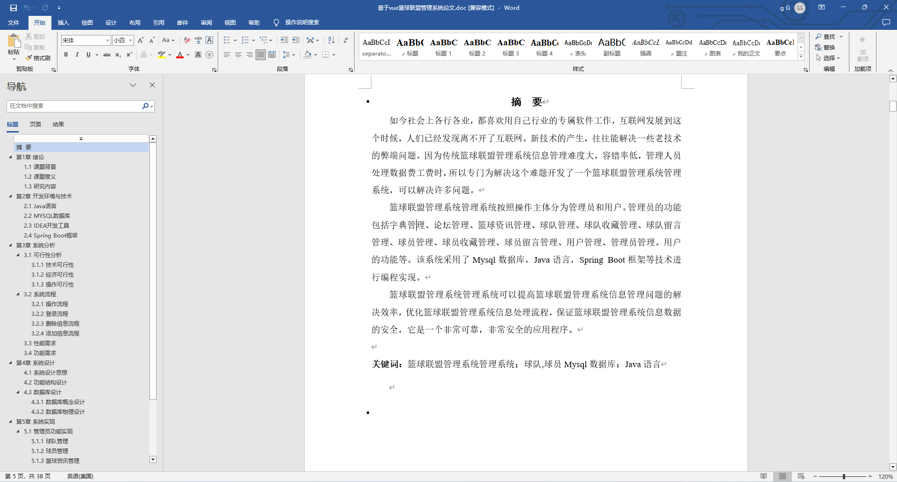
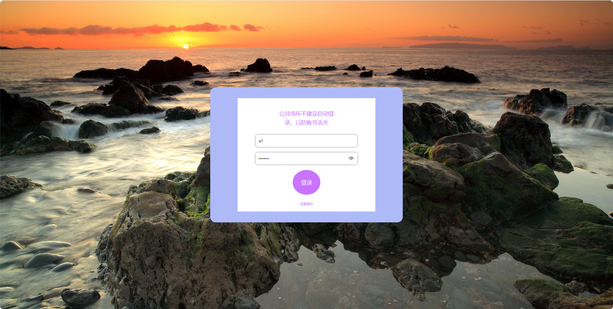
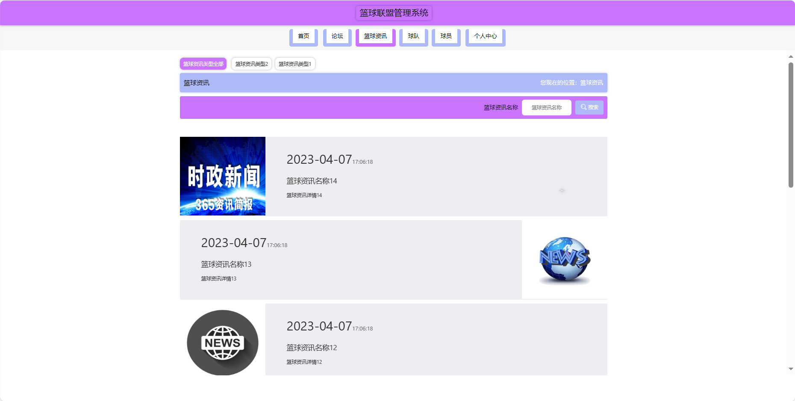
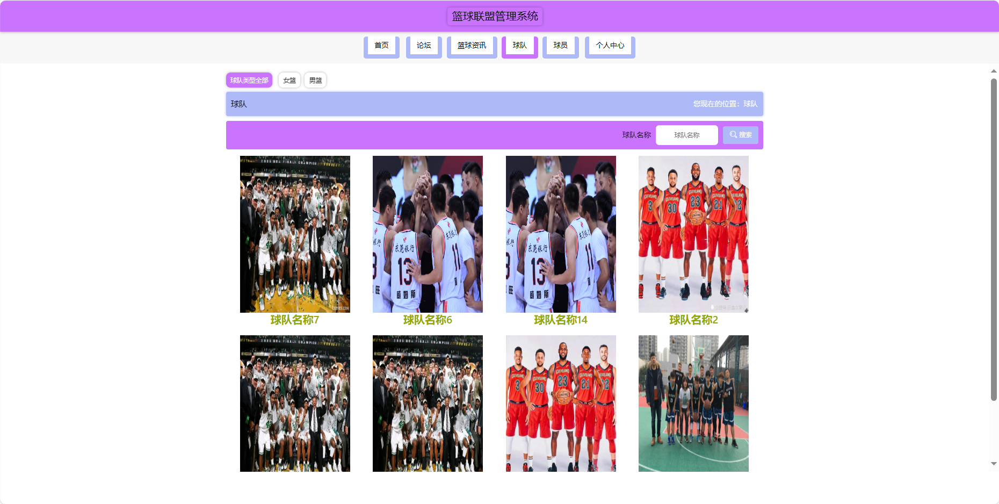
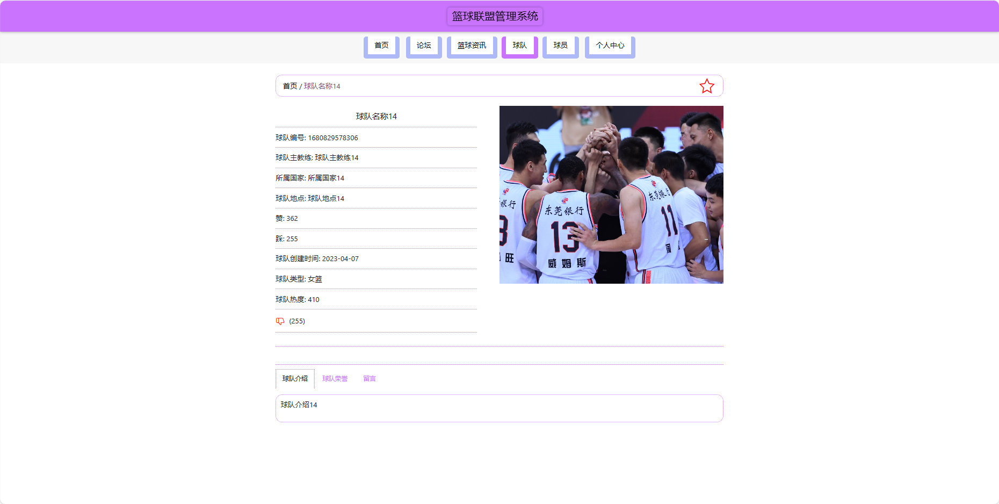
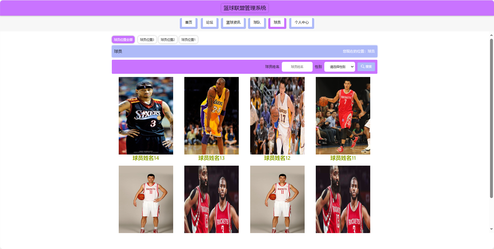
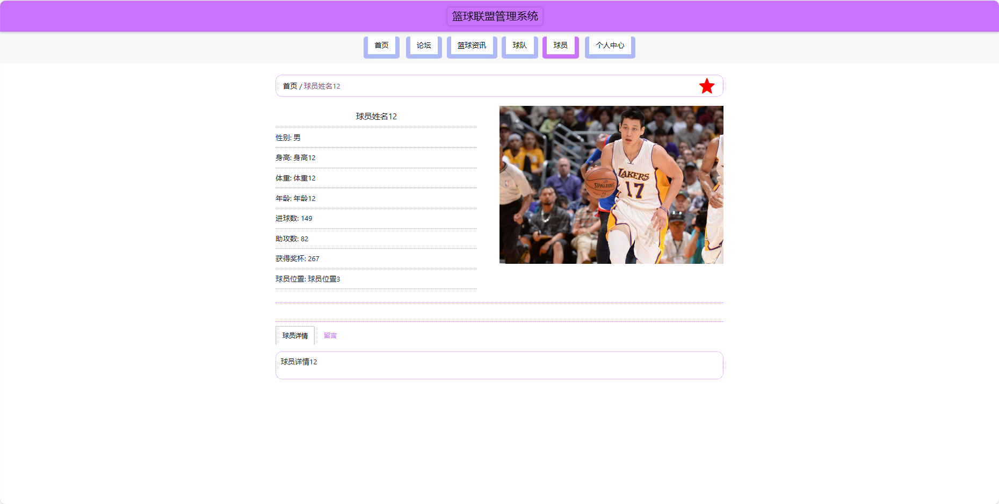
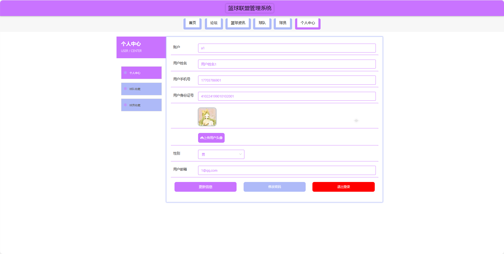
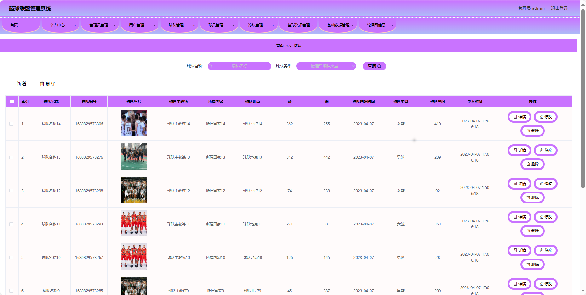

## 基于SpringBoot的篮球联盟管理系统(程序+报告)

- <b>完整代码获取地址：从戎源码网 ([https://armycodes.com/](https://armycodes.com/))</b>
- <b>技术探讨、资料分享，请加QQ群：692619798</b> 
- <b>作者微信：19941326836  QQ：952045282</b> 
- <b>承接计算机毕业设计、Java毕业设计、Python毕业设计、深度学习、机器学习</b>
- <b>选题+开题报告+任务书+程序定制+安装调试+论文+答辩ppt 一条龙服务</b>
- <b>所有选题地址 ([https://github.com/YuLin-Coder/AllProjectCatalog](https://github.com/YuLin-Coder/AllProjectCatalog)) </b>

## 项目介绍
基于SpringBoot的篮球联盟管理系统，系统包含两种角色：管理员、用户主要功能如下。

### 【管理员】:
首页：查看篮球联盟整体。
个人中心：管理个人信息。
管理员管理：管理系统的管理员账户。
用户管理：管理系统注册用户的信息。
球队管理：编辑和管理篮球联盟中各支球队的信息。
球员管理：编辑和管理篮球联盟中各支球队的球员信息。
论坛管理：监管和管理篮球社区的帖子、评论等。
篮球资讯管理：发布、编辑和删除篮球相关的新闻和资讯。
基础数据管理：管理系统的基础数据。
轮播图信息：管理系统首页轮播图的内容和展示顺序。

### 【用户】:
首页：查看篮球联盟的基本信息。
论坛：参与篮球社区的讨论和交流。
篮球资讯：浏览与篮球相关的新闻和资讯。
球队：查看篮球联盟中各支球队的信息和战绩。
球员：浏览篮球联盟中各支球队的球员信息。
个人中心：管理个人信息、查看个人收藏和历史记录等。

## 项目技术
- 编程语言：Java
- 数据库：MySQL
- 项目管理工具：Maven
- 前端技术：HTML、CSS、JavaScript、Jquery、Vue
- 后端技术：Spring、SpringMVC、MyBatis

## 运行环境
- JDK版本：JDK1.8及以上
- 开发工具：IDEA、Ecplise、Myecplise都可以
- 数据库: MySQL5.7及以上
- Maven：maven3.0及以上
- Node：14.14.0及以上

## 运行截图

